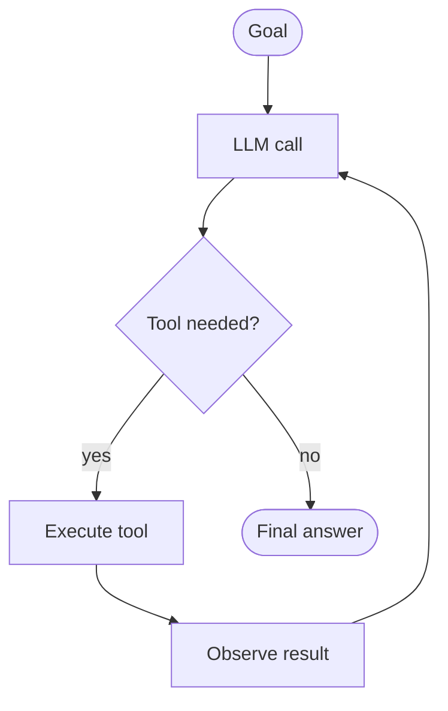

# Building AI Agents — 2-Hour Workshop

> A hands-on workshop for engineering students and faculty. We build a working AI agent in under 150 lines of Node.js, break it live, and understand why most agents fail in production.

**Presenter:** [Rahul Ladumor](https://rahulladumor.in) · Solo AWS + AI consultant
**Audience:** Engineering students + faculty
**Duration:** 2 hours

---

## What you'll walk out with

1. A clear answer to: **what IS an agent?** (and how it differs from a chatbot)
2. The **one loop** that explains every agent ever built
3. A **working 60–150 line agent** you watched me type — you have it in this repo
4. **Five ways agents fail in production** — and how real teams defend

---

## The core idea (in one picture)



> **An AI agent is a system that pursues a goal by running a loop in which an LLM decides, at each step, what action to take next.**

Three parts: **Goal. Loop. Decisions at each step.** Miss one — it's not an agent.

---

## Quick start (3 steps)

```bash
# 1. Clone
git clone https://github.com/rahulladumor/ai-agents-workshop.git
cd ai-agents-workshop

# 2. Install + add your API key
npm install
cp .env.example .env
# Edit .env and paste your Anthropic API key

# 3. Run
node --env-file=.env agent.js
# → Agent running on http://localhost:3000
```

Test it in another terminal:

```bash
curl -sX POST http://localhost:3000/ask \
  -H 'Content-Type: application/json' \
  -d '{"question":"How many students in CSE this semester?"}'
```

You should see two iterations logged (`[iter 1] -> tools: getStudentCount`, `[iter 2] -> final answer`) and a real answer come back. If you do — you've just run an agent.

---

## Don't have an Anthropic API key?

Two options:
- **Get one** — https://console.anthropic.com/ · you need ~$1 of credit for the whole workshop (Haiku 4.5 is the cheap tier)
- **Follow along in read-only mode** — read [`agent.js`](./agent.js) and the [docs](./docs/), do the [exercises](./exercises/). You won't miss the core learning.

---

## Repo layout

```
ai-agents-workshop/
├── README.md               ← you are here
├── agent.js                ← the live-demo code (under 150 lines)
├── package.json
├── .env.example
├── docs/
│   ├── 01-concepts.md      ← what/why — deeper teaching notes
│   ├── 02-the-loop.md      ← the loop, step by step
│   ├── 03-architecture.md  ← production architecture + end-to-end trace
│   └── 04-production.md    ← how agents fail + how teams defend
├── exercises/
│   ├── 01-trace-the-loop.md     ← warm-up (3 minutes, on paper)
│   └── 02-design-your-agent.md  ← main exercise (7 minutes, in pairs)
└── CHALLENGES.md           ← extensions to try after the workshop
```

---

## What an agent is NOT

These all get called "agents" but aren't, under the definition above:

| Not an agent | Why |
|---|---|
| An LLM call | No loop |
| A chatbot | No actions, no tools |
| A Zapier / n8n workflow | Decisions are hard-coded by a human |
| A RAG system | No tool use beyond search |
| LLM + one tool call | No iteration |

**Dividing line:** hard-coded path → automation. LLM decides at runtime → agent.

---

## Chatbot vs Agent

|          | Chatbot      | Agent                    |
|----------|--------------|--------------------------|
| Input    | text         | goal                     |
| Output   | text         | action + result          |
| Loop     | single turn  | iterative                |
| Tools    | none         | many                     |
| State    | conversation | conversation + world     |
| Memory   | optional     | required (eventually)    |

> A chatbot tells you the weather.
> An agent books the cab because the weather is bad.

---

## What's in the demo agent

- **Endpoint:** `POST /ask`
- **Model:** `claude-haiku-4-5` (cheap, fast, excellent at tool use)
- **Tools:** `getStudentCount`, `listCourses` — return hardcoded campus data
- **Framework:** none. Just Express + the Anthropic SDK.
- **Memory:** session-only (no persistent memory across requests)
- **Max iterations:** 5 (the fuse)

Try these four queries to see different parts of the loop:

```bash
# Simple: one tool call, two LLM calls
curl -sX POST http://localhost:3000/ask -H 'Content-Type: application/json' \
  -d '{"question":"How many students in CSE this semester?"}'

# No tool: one LLM call
curl -sX POST http://localhost:3000/ask -H 'Content-Type: application/json' \
  -d '{"question":"What is 2 plus 2?"}'

# Error recovery: model reads the error and retries
curl -sX POST http://localhost:3000/ask -H 'Content-Type: application/json' \
  -d '{"question":"How many students in Computer Science?"}'

# Multi-tool: model chains two calls in one request
curl -sX POST http://localhost:3000/ask -H 'Content-Type: application/json' \
  -d '{"question":"Tell me everything about CSE — student count and courses."}'
```

---

## Going deeper (in recommended reading order)

1. [**docs/01-concepts.md**](./docs/01-concepts.md) — what an agent is, what it isn't, when it's the right tool
2. [**docs/02-the-loop.md**](./docs/02-the-loop.md) — the loop, step by step, with code
3. [**docs/03-architecture.md**](./docs/03-architecture.md) — production architecture, end-to-end trace
4. [**docs/04-production.md**](./docs/04-production.md) — how agents fail, how real teams defend
5. [**exercises/**](./exercises/) — two hands-on exercises
6. [**CHALLENGES.md**](./CHALLENGES.md) — 10 ideas to extend the demo after the workshop

---

## License

MIT — use it, fork it, remix it, teach with it. Attribution appreciated but not required.

---

## Contact

- **Website:** [rahulladumor.in](https://rahulladumor.in)
- **LinkedIn:** [in/rahulladumor](https://linkedin.com/in/rahulladumor)
- **Issues / questions:** open a [GitHub issue](https://github.com/rahulladumor/ai-agents-workshop/issues) on this repo

I answer every real question.
