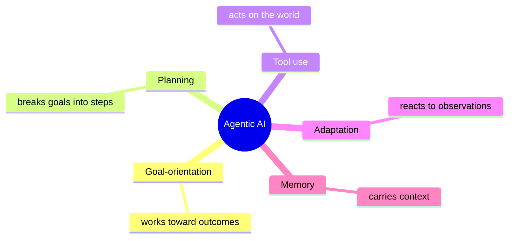

# 01 · Concepts

## What an agent is

> **An AI agent is a system that pursues a goal by running a loop in which an LLM decides, at each step, what action to take next.**

Three parts matter:

1. **Goal** — not a question, a goal. "Book me a room" is a goal. "What is 2+2" is a question.
2. **Loop** — the system keeps going until the goal is met or a limit is hit.
3. **Decisions at each step** — the LLM isn't answering once; it's steering, step by step.

---

## What an agent is NOT

| Thing | Why it's not an agent |
|---|---|
| An LLM call | One-shot. No loop. No tools. |
| A chatbot | Answers questions. Doesn't act. No side effects. |
| Zapier / n8n | Steps are hard-coded. No runtime decision. |
| RAG | Retrieval + answer. No iteration, no real tool use. |
| LLM + 1 tool call | Closer, but still not an agent without a loop. |

**Dividing line:** who decides what happens next?
- Hard-coded → automation.
- LLM decides at runtime → agent.

---

## Agent vs Agentic AI

People use these interchangeably. They shouldn't.

- **AI Agent** — the instance. One system you build.
- **Agentic AI** — the paradigm. Building AI systems where the AI has *agency* — it plans, acts, adapts, remembers.

Same relationship as:
- `object` vs object-oriented programming
- `container` vs containerization

---

## The five capabilities of agentic AI



- **All five** → strongly agentic
- **Some** → weakly agentic
- **None** → not an agent

Use this as a checklist when evaluating any product that calls itself an "agent."

---

## The autonomy spectrum

```
Assistive ────── Supervised ────── Autonomous
(copilot)        (approval gates)   (runs alone)

GitHub Copilot → Claude Code    → Devin, bg agents
you accept       approves each    runs for hours
each suggestion  tool call        reports back
```

**Rule:** more blast radius → push further left on this line.

Most production agents live in the middle. Fully autonomous is rare, hard, and expensive.

---

## When to use an agent

### Good fit

- ✓ Path isn't known in advance
- ✓ Goal is describable in text
- ✓ Real tools / actions are needed
- ✓ Failure is tolerable or recoverable
- ✓ Loop is bounded (≤ 10 iterations)

### Bad fit

- ✗ Deterministic task (scheduling, arithmetic)
- ✗ One mistake costs real money
- ✗ Needs 100+ steps
- ✗ Pure Q&A → use RAG
- ✗ Already solved by a simple API call

**Most expensive mistake:** using an agent when a SQL query would have done the job.

---

## The filter I use

Before saying yes to an agent project:

- **Q1.** Is the goal specifiable in text? → No: not an agent
- **Q2.** Does it need real tools / actions? → No: use RAG or an LLM call
- **Q3.** Is failure recoverable? → No: tighten controls or pick a different architecture
- **Q4.** Can the loop be capped at ≤10 steps? → No: wrong tool

**All four yes** → agent is a candidate.
**Otherwise** → pick a different architecture.

---

## What agents are actually doing in production

| Category | Example | What it does |
|---|---|---|
| Coding | Cursor, Claude Code | edit repo, run tests, fix bugs |
| Support | Intercom Fin, Sierra | answer + refund / escalate |
| Research | Deep Research | search + synthesize reports |
| Operations | Invoice agents | OCR + match + route |
| DevOps | Incident triage | read logs, summarize alerts |
| Long-form | Devin, bg Claude | run for hours → deliver a PR |

---

## Next

→ [02 · The Loop](./02-the-loop.md) — how it works, step by step
