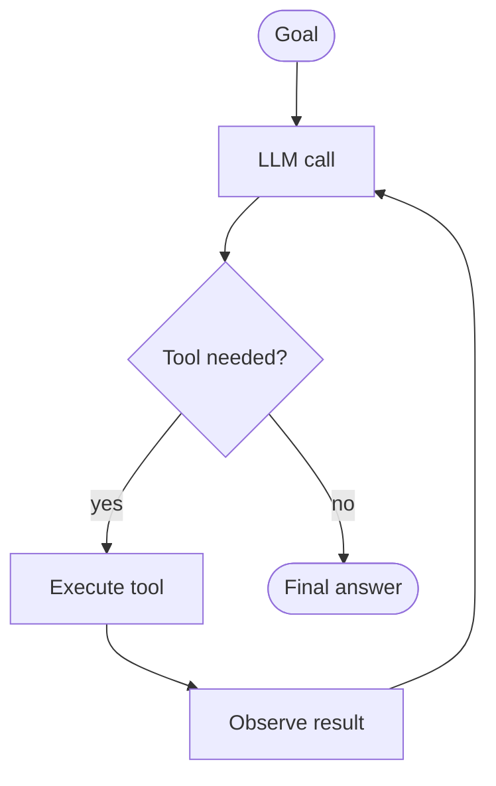

# 02 · The Loop

The single most important idea in this workshop. Every agent is this picture.



Four parts: goal, LLM call, tool execution, observation. The loop runs until the LLM produces a final answer (no tool call) or the iteration limit is hit.

---

## Step by step — with a concrete example

**User goal:** "How many students in CSE this semester?"

### Step 1 · Input

The system receives the raw text. The LLM is **stateless** — it has no memory of this user, no knowledge of your business, no idea what CSE means. Whatever it needs, you hand-feed.

### Step 2 · Context building

The orchestrator assembles a system prompt, a message array, and a tool list:

```js
system = "You are a campus assistant..."

messages = [
  { role: "user", content: "How many students in CSE?" }
]

tools = [ getStudentCount, listCourses, ... ]
```

**System prompt** is the agent's identity and rules.
**Tools** are its hands.
Together, they define what the agent can and cannot do.

> Note: the Anthropic Messages API takes the system prompt as a separate top-level field, not as a message in the array. (OpenAI's Chat Completions API puts it inside `messages[]` as `{role: "system", ...}`. Different shape, same idea.)

### Step 3 · First LLM call — the decision

The model returns one of two things:
- A tool call (structured JSON)
- A text answer

For this question, it returns a response with `stop_reason: "tool_use"` and a content block:

```json
{
  "stop_reason": "tool_use",
  "content": [
    {
      "type": "tool_use",
      "id": "toolu_abc123",
      "name": "getStudentCount",
      "input": { "department": "CSE" }
    }
  ]
}
```

**The model runs nothing.** It emits a request. Our code decides whether to honor it.

### Step 4 · Validate, then execute

Before running anything:

1. Does the tool exist in our registry? ✓
2. Do the args match the JSON schema? ✓
3. Is this user allowed to call this tool? ✓
4. Run the function → `420`

Every tool argument is **untrusted input**. Treat it like a form submission from a stranger. Validate first.

### Step 5 · Observation

The tool result is appended to the message history as a `user` message containing a `tool_result` block:

```js
messages.push({
  role: "user",
  content: [
    {
      type: "tool_result",
      tool_use_id: "toolu_abc123",
      content: JSON.stringify({
        department: "CSE",
        count: 420,
        semester: "Spring 2026"
      })
    }
  ]
})
```

Now the conversation contains: user(question) + assistant(tool_use) + user(tool_result).

> Why is the tool result under `role: "user"`? Anthropic treats tool results as information flowing *into* the model, same as a user message. OpenAI uses a separate `role: "tool"`. Different convention, same semantics.

### Step 6 · Second LLM call — final answer or next tool

The model sees the updated history and emits a plain text response:

> "There are 420 students enrolled in CSE for Spring 2026."

No tool call this time. Loop exits.

**Total:** 2 LLM calls, 1 tool execution, ~2 seconds.

---

## The whole thing in code

Here's the core of the loop from [`../agent.js`](../agent.js):

```js
async function runAgent(userMessage) {
  const system = '...';
  const messages = [{ role: 'user', content: userMessage }];

  for (let i = 0; i < MAX_ITERATIONS; i++) {
    const resp = await anthropic.messages.create({
      model: MODEL,
      max_tokens: 1024,
      system,
      tools,
      messages
    });

    messages.push({ role: 'assistant', content: resp.content });

    if (resp.stop_reason === 'tool_use') {
      const toolUseBlocks = resp.content.filter(b => b.type === 'tool_use');
      const results = toolUseBlocks.map(b => ({
        type: 'tool_result',
        tool_use_id: b.id,
        content: JSON.stringify(executeToolSafely(b))
      }));
      messages.push({ role: 'user', content: results });
      continue;
    }

    const text = resp.content.find(b => b.type === 'text');
    return { answer: text?.text ?? '', iterations: i + 1 };
  }

  return { answer: 'Iteration limit reached.', iterations: MAX_ITERATIONS };
}
```

That's it. Everything you've seen marketed as "agentic AI" is a variation on this loop. Memory is a variation. Multi-agent is a variation. Planning is a variation. This is the primitive.

---

## The LLM is the brain. Your code is everything else.

| The LLM does | Your code does |
|---|---|
| Decide the next step | Assemble context |
| Emit tool calls | Call the LLM |
| Write the final message | Parse the response |
| | Validate arguments |
| | Check permissions |
| | Execute tools |
| | Handle errors |
| | Enforce limits |
| | Log everything |
| | Manage memory |
| | Retry on failure |

**You are not "using AI."** You are engineering a system that uses AI as one fallible, expensive, brilliant component. That's the mindset shift.

---

## What if the loop doesn't end?

- **Problem:** LLM keeps calling tools forever.
- **Defense:** `MAX_ITERATIONS = 5` (or 8, or 10). If hit, return a stopped message.

Also watch for:
- Same tool + same args → detect and break
- Context growing each step → token / cost spike
- One bad tool erroring forever → per-tool retry cap

**Every loop needs a fuse.** Without one, you'll ship an agent that burns through your API budget in a single bad session.

---

## ReAct vs Plan-and-Execute

Two dominant patterns:

**ReAct** (what the demo uses)
- decide → act → observe → decide → ...
- Simple. Works well for short tasks.
- 95% of production agents use this.

**Plan-and-Execute**
- LLM generates the full plan first, then executes each step.
- Better for long or background tasks.
- Harder to adapt mid-flight.

---

## Next

→ [03 · Architecture](./03-architecture.md) — what a real agent system looks like
