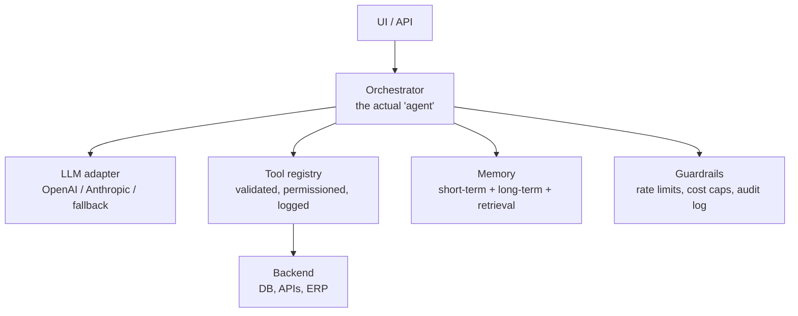
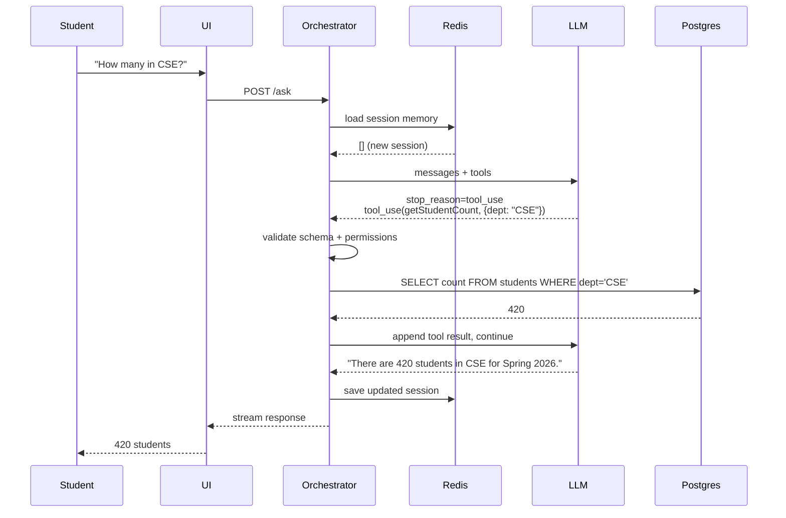

# 03 · Architecture

What a production agent system actually looks like.

**Every box on this diagram exists because something failed in production.** None of it is theoretical. If you strip any of these out, you'll regret it within the first 100 real users.

---

## Why each layer exists

### UI / API layer
Chat UI, HTTP endpoint, Slack bot, CLI — whatever the user touches. Does nothing smart. Ships the user's input to the orchestrator and streams the response back.

**Why separate:** tomorrow you'll add a mobile app, a Slack integration, a voice interface. The core agent shouldn't know or care.

### Orchestrator (the actual "agent")
The loop. Manages the message array, calls the LLM, parses tool calls, validates arguments, invokes tools, handles errors, enforces iteration limits, logs everything.

**Why this matters:** most people think the LLM is the agent. It's not. The orchestrator is the agent. The LLM is a dumb, expensive, fallible oracle the orchestrator consults.

### LLM adapter
Abstraction over the model provider. Handles retries, rate limits, model fallback (Haiku for routing, Sonnet/Opus for reasoning), token counting, cost tracking.

**Why:** the day Anthropic (or OpenAI, or any provider) has an outage — and they will — you swap in an alternative without touching your orchestrator. The demo agent uses `claude-haiku-4-5`, which is fast and cheap; for production reasoning you'd typically step up to `claude-sonnet-4-6` or `claude-opus-4-7`.

### Tool registry
A registry of functions, each with a schema, a handler, a timeout, a permission check, an audit log.

**Rule:** tools are the agent's hands. Treat them like you'd treat a new intern with database access. Scoped, logged, reviewed.

### Memory
Three kinds (see below).

### Guardrails
- Input validation, output validation
- Rate limits (per user, per endpoint, per tool)
- Cost limits (max tokens per request, max cost per user per day)
- Audit log (every LLM call, every tool call, every result)
- Human-in-the-loop approval gates for high-blast-radius actions

---

## Memory — three distinct kinds

People confuse these three. They shouldn't.

| Kind | What | Lives where |
|---|---|---|
| **Working memory** | Current request's message array | RAM / Redis, duration of request |
| **Conversation memory** | Past sessions with this user | Postgres, keyed by user |
| **Retrieval (RAG)** | Documents, facts, external knowledge | Vector store (pgvector, Pinecone, etc.) |

**Start with #1.** Add #2 when users complain about the agent forgetting. Add #3 only when the tools can't answer from structured data alone.

Most teams build #3 first because it's the shiny one. That's almost always wrong.

---

## End-to-end trace — campus assistant

A single request, from user click to answer.

Numbers to notice:
- **2 LLM calls** (decide + answer)
- **1 tool execution** (the DB query)
- **~380 tokens** total
- **~₹0.02** in model costs
- **~1.8 seconds** end-to-end

Scale that up mentally to a 5-step task: 6 LLM calls, 5 tool runs, ~10 seconds. That's why latency and cost become real problems fast.

---

## What "production-grade" actually means

Not just "it works on my laptop." Production-grade means:

- ✓ Logs every LLM + tool call (replayable from logs)
- ✓ Caps cost per user per day
- ✓ Times out slow tools
- ✓ Fails over if provider is down
- ✓ Human approves destructive actions
- ✓ An eval set runs on every deploy

If your agent doesn't do these six, it's a demo, not a product.

---

## Next

→ [04 · Production reality](./04-production.md) — how agents fail and how real teams defend
